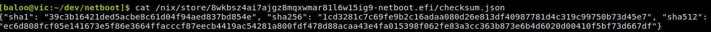
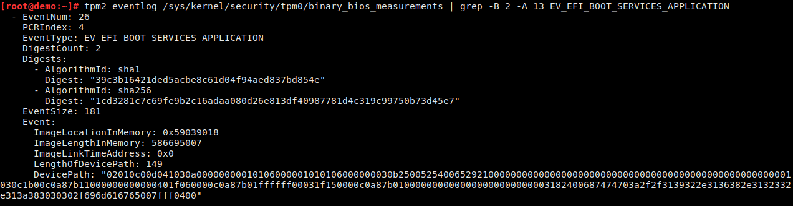

# NixOS image build-reproducibility lab

Welcome to @baloo's lab.

What you'll find here is a prototype of a usecase for build-reproducibility. This aims at answering one question: Can you prove you're running what you say you're running.

How to answer that question:
  - [ ] Get your build reproducible.

    Are we there yet? no, but close. https://www.r13y.com

    The last two outstanding issues are being worked on:
      - https://github.com/NixOS/nixpkgs/pull/107965
      - https://github.com/NixOS/nixpkgs/pull/112928

  - [x] Get a PE/COFF checksum of the built image
    

  - [x] Boot a linux image that will be hashed by a TPM.

  - [x] Extract the TPM eventlog to get the different element that were involved in building the PCR[4]
    

  - [ ] Get an attestion of the current state (most importantly here, the PCR[4]) of the system using a remote attestation protocol:
    https://safeboot.dev/attestation/#attestation-protocol

From that point, you should be able to:
  - Take the source of the build tree.
  - Rebuild it, and, given the same parameters, get the same checksum for the target image.
  - Get a copy of the event log, rebuild the PCR[4] from this eventlog.
  - Compare the last element of PCR[4] to your PE checksum (from your build)
  - Get an attestion, crossed signed to the TPM manufacturer root key.

## Lab requirements

The lab runs on my system's libvirt. But this needs a couple things:

 - Ability to run swtpm for the tpm implementation:
   https://github.com/NixOS/nixpkgs/pull/114057
   (please note the comments there, which gives the "configuration example" as well)

 - Patches on OVMF. By default OVMF http-boot will only wait 5sec for the http server to reply. This is a bit short to generate a full system image. (also needs a couple other build options).
   current build in my overlay:
```
  OVMF = (super.OVMF.override { secureBoot = true; }).overrideAttrs(old: {
    patches = [
      ./pkgs/ovmf/http-boot-timeout.patch
    ];

    buildPhase = ''
      runHook preBuild
      # Get a debug build which gives a debug log
      # qemu: (see lab/server.xml)
      # -debugcon file:/var/lib/libvirt/qemu/nvram/debug.log
      # -global isa-debugcon.iobase=0x402
      build -a X64 -b DEBUG -t GCC5 -p OvmfPkg/OvmfPkgX64.dsc -n $NIX_BUILD_CORES $buildFlags
      runHook postBuild
    '';

    buildFlags = old.buildFlags ++ [
      "-DTPM_ENABLE=TRUE"
      "-DTPM_CONFIG_ENABLE=TRUE"
      "-DNETWORK_HTTP_ENABLE=TRUE"
      "-DNETWORK_HTTP_BOOT_ENABLE=TRUE"
    ];
  });
```
